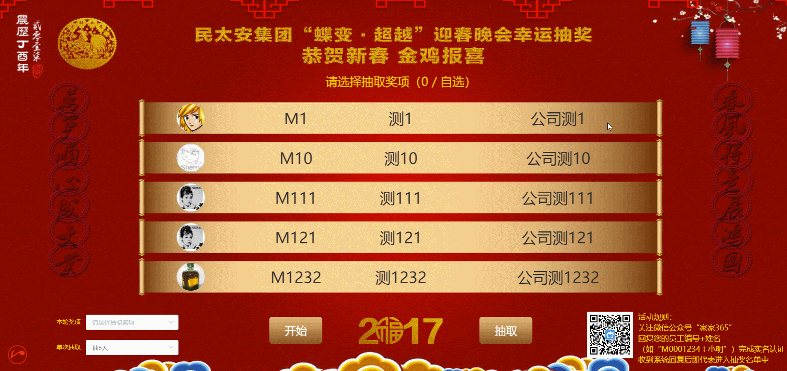
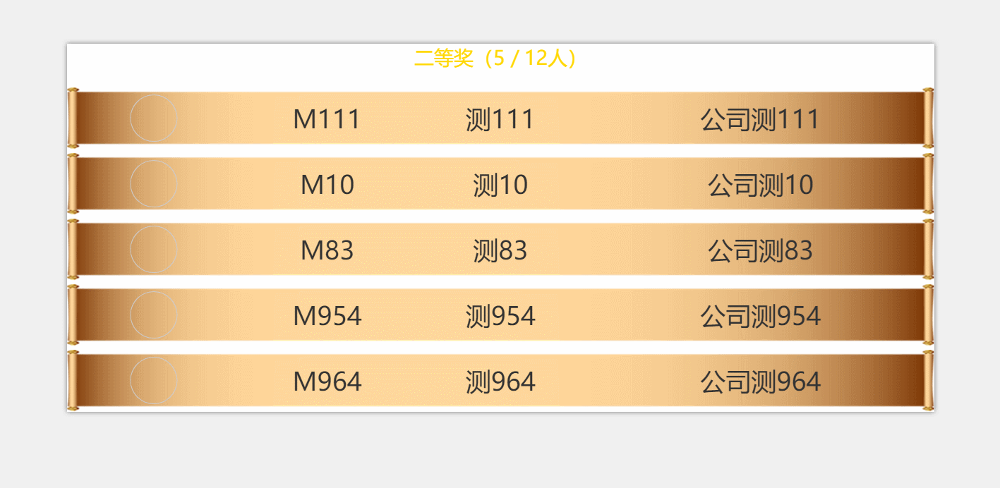

# 简介

> 基于vue.js抽奖项目，截屏保存每次抽奖图片至本地，附带背景音乐

> 技术栈：vue + vuex + vue-router + axios + mock + elementUI + html2canvas + nprogress + less + ECMAjavascript6

本项目目前处于持续更新阶段，欢迎star，issue关注！

## 说明
### 实现思路
本项目主要有以下几个点需要`注意`：
1. 为了保证数据安全，需要设置登录，在登录成功之后的前提下获取后台传递的数据，以及回传数据也需要验证是否已登录；
2. 这里利用mock来模拟数据，考虑正式抽奖的数据都上千条，cookie和storage存储空间受限都不够用，依次考虑利用浏览器支持的indexDB来存储用户数据库，以及主要奖项和该奖项抽取的人数的；
3. 每次抽奖完成的结果，须返回给后台存储数据，以保障前后台数据一致性（实现具体抽奖的逻辑功能，不受限，取决于前后台同事自己沟通结果，本示例前端实现抽取，在[src/views/lottery](src/views/lottery.vue)文件内）；
4. 记录单次抽奖人数，不论抽多少次，只要满足本轮奖项人数，即宣告本轮抽取结束，代码逻辑不以抽取多少次为依据；
5. 同时每次抽中的用户数据需要三步处理：
    >A. 回传至后台；

    >B. 同步至本地indexDB，防止当前页刷新时丢失已抽中用户数据，再一次进入抽奖池；

    >C. 截取抽奖屏幕图，用于事后比对；
6. 考虑抽奖现场肯定会加抽奖项的环节（不多说，参与过年会的都知道，没抽中的人肯定会叫喊老板现场再抽的），故可以在后台设置其他将，人数为空(若为空。前端会默认设置抽取99人，毕竟加抽的奖项人数，99人足够啦，)，或者更多，这里也可灵活变动；

### 配置文件

数据的构造，参照如下代码结构：
```code
// 抽奖数据
data: {
  // 用户
  userData: [
    {Company: '公司测1', CompleteID: '1', HeadImg: 'http://test.baoxianadmin.com/static/m/images/headImage/1.jpg', Name: '测1', Num: 'M1', OpenID: '1', Award: '0'},
    {Company: '公司测13', CompleteID: '13', HeadImg: 'http://test.baoxianadmin.com/static/m/images/headImage/13.jpg', Name: '测13', Num: 'M13', OpenID: '13', Award: '0'}
  ],
  // 奖项
  type: [
    {value: '9', label: '特等奖', number: '3'},
    {value: '1', label: '一等奖', number: '5'},
    {value: '2', label: '二等奖', number: '12'},
    {value: '3', label: '三等奖', number: '20'},
    {value: '4', label: '参与奖', number: '28'},
    {value: '5', label: '其他', number: ''}
  ]
}
```

本项目配置文件位于[src/utils/config](src/utils/config.js)，按照注释相应地修改对应项就好。
`注意`：XXX为示例名，需要依据自己项目来修改
```code

// global config 注意: 所有接口均为mock测试，项目中需要自己替换
const config = {
  // 1.登录页
  login: {
    // 登录请求地址
    url: '/zt_lottery/login',
    // 检测登陆状态
    checkUrl: '/zt_lottery/check_login',
    state: {
      // 当前公司提示语
      msg: '民太安集团年会抽奖系统',
      form: {
        username: 'admin',
        trigger: 'blur'
      }
    }
  },
  // 2.加载数据页
  onload: {
    // 获取数据地址
    url: '/zt_lottery/list_member'
  },
  // 3.中奖活动页
  lottery: {
    // 回传中奖数据地址
    url: '/zt_lottery/add',
    state: {
      // 样式
      style: {
        // 主背景图
        bg: {
          backgroundImage: `url(${require('../assets/images/background.png')})`,
          backgroundRepeat: 'no-repeat',
          backgroundSize: '100% 100%'
        },
        // 当前抽奖年
        year: {
          show: false,
          img: require('../assets/images/2017.png')
        }
      },
      // 是否需要下载抽奖截图
      download: {
        show: true,
        delay: 800
      },
      // 滚动间隔
      intervalTime: 80,
      // 绑定键盘事件
      keyBand: {
        start: 'Enter',
        stop: 'Space'
      }
    }
  },
  // 4.全局state状态
  state: {
    // indexDB名称
    DBname: 'lottery2018',
    // indexDB版本
    DBver: '2',
    // indexDB存储表名称
    storeName: {
      user: 'user', // 用户
      award: 'type' // 奖项
    },
    // 背景音乐
    music: {
      show: false,
      src: require('../assets/shiji.mp3') // 在请求资源路径时，需要require
    },
    // 参与规则
    rule: {
      show: true,
      img: require('../assets/images/QR-code.jpg'),
      html: '<p>活动规则：<br>关注微信公众号“家家365”<br>回复您的员工编号+姓名<br>（如“M0001234王小明”）完成实名认证<br>收到系统回复后即代表进入抽奖名单中</p>'
    }
  }
}
```

## 功能
1. 抽奖前，选择需要抽取的奖项
2. 点击开始抽奖按钮(或Enter回车键)，数据滚动
3. 点击抽取(或space空格键)结束滚动，显示中奖人员
4. 再点击开始抽取进入第2步循环，若完成本轮抽取，则进入第1步选择抽取其他奖项

## 截图
一。界面截图：
针对1920*1080大屏以上显示，不适配移动端，以下为该项目主要界面截图：




二。抽奖截屏：


自动保存的抽奖截图文件至本地思路：
1. 实现的流程逻辑在[src/utils/screenshot](src/utils/screenshot.js)文件中；
2. 由于浏览器browser不支持node.js的模块fs读写文件，因而本示例采用`html2canvas`来完成截图功能，具体的使用自行百度或谷歌；
3. 截完屏，最主要的是需要自动保存至本地，利用a标签的download和herf属性可以实现，通过在结束时，自动调用click的事件来触发；
4. 最后剩余一个`BUG`，在截屏里面，是没有将图像获取下来，猜测可能是由于`html2canvas`的issue，也或者是由于之前缓存页面加载过的原因，但相对来说也可接受；

## 开发

``` bash
# 克隆项目
git clone https://github.com/renmingliang/vue-lottery.git

# 切换至目录
cd vue-lottery

# 安装依赖
npm install

# 本地浏览器地址：localhost:9301
npm run dev

# 发布正式版本
npm run build

# build for production and view the bundle analyzer report
npm run build --report
```

For a detailed explanation on how things work, check out the [guide](http://vuejs-templates.github.io/webpack/) and [docs for vue-loader](http://vuejs.github.io/vue-loader).
